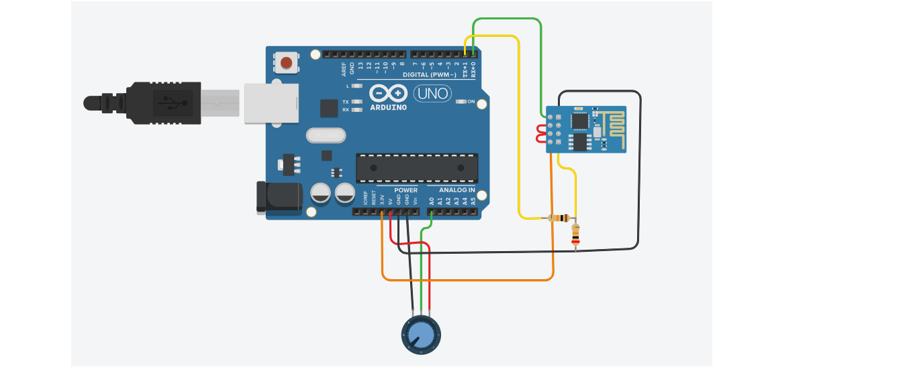
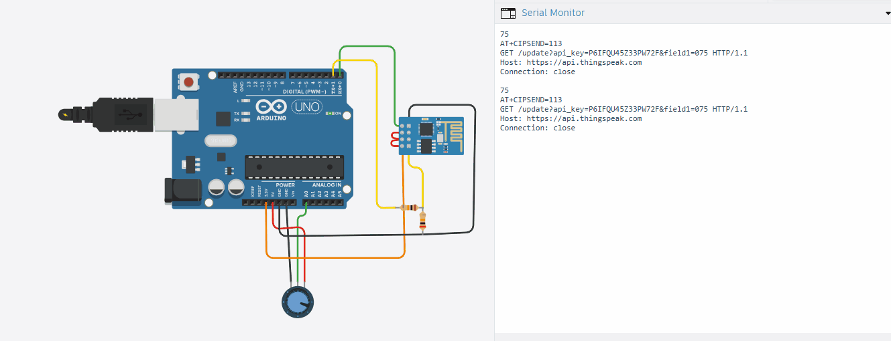

# ESP8266 with Arduino for ThingSpeak IoT

An IoT system that uses ESP8266 WiFi module with Arduino Uno to upload sensor data to ThingSpeak cloud. This demo reads a potentiometer value, maps it to 0-100, and sends it to ThingSpeak using AT commands.

### **Circuit Diagram**

### **How It Works**
The ESP8266 is a WiFi module controlled by Arduino using AT commands via Serial.

1. Arduino communicates with ESP8266 at 115200 baud using `Serial.println()`
2. `AT` command checks if ESP8266 is responding
3. `AT+CWJAP` connects ESP8266 to WiFi using SSID and password
4. `AT+CIPSTART` opens TCP connection to `api.thingspeak.com` on port 80
5. Arduino reads potentiometer on A0 and maps 0-1023 to 0-100
6. `AT+CIPSEND` + HTTP GET request uploads data to ThingSpeak field1
7. ThingSpeak stores data and plots real-time graphs

This demonstrates IoT, WiFi communication, AT commands, and cloud data logging.

### **Demo**

> **Note**: GIF shows Tinkercad simulation. Potentiometer value changes → AT commands sent to ESP8266 → Data uploaded to ThingSpeak. Serial Monitor shows WiFi connection and HTTP request.

### **Components Required**
| Component | Quantity |
| --- | --- |
| Arduino Uno R3 | 1 |
| ESP8266-01 WiFi Module | 1 |
| Potentiometer 10kΩ | 1 |
| 1kΩ Resistor | 1 |
| 2.2kΩ Resistor | 1 |
| Breadboard + Jumper Wires | - |

### **Circuit Connections**
| Component | Arduino Pin / ESP8266 Pin |
| --- | --- |
| ESP8266 VCC, CH_PD | 3.3V |
| ESP8266 GND | GND |
| ESP8266 TX | Arduino D2 via voltage divider |
| ESP8266 RX | Arduino D3 |
| Potentiometer Pin 1 | 5V |
| Potentiometer Pin 2 | A0 |
| Potentiometer Pin 3 | GND |
| Voltage Divider | 1kΩ + 2.2kΩ between Arduino TX and ESP8266 RX |

### **Code**
File: `esp8266_with_arduino.ino`

### **How to Use**
1. Clone or download this repository.
2. Create free account at thingspeak.com → Create new channel → Copy Write API Key.
3. Replace api_key in code with your API key.
4. Open ESP8266_ThingSpeak.ino in Arduino IDE.
5. Build circuit as per diagram.
6. **Important:** ESP8266 uses 3.3V, not 5V.
7. **Select Board:** Arduino Uno and correct COM Port.
8. Click Upload.
9. Open Serial Monitor at 115200 baud to see AT commands.
10. In Tinkercad: Turn potentiometer → Data uploads to ThingSpeak.
11. Check your ThingSpeak channel for live graph.

### **Key Concepts Learned**
1. **ESP8266 WiFi Module:** Low-cost IoT module controlled via AT commands.
2. **AT Commands:** Standard command set for modems/WiFi modules like AT, AT+CWJAP, AT+CIPSTART.
3. **IoT Cloud:** Uploading sensor data to ThingSpeak for remote monitoring.
4. **Serial Communication:** Arduino ↔ ESP8266 at 115200 baud rate.
5. **HTTP GET Request:** Format needed to send data to web APIs.
6. **Voltage Divider:** Protecting 3.3V ESP8266 RX pin from 5V Arduino TX.
7. **API Keys:** Using write keys to authenticate with cloud services.

### **Important Notes**
1. **3.3V Only:** ESP8266 will burn if connected to 5V. Use Arduino 3.3V pin for VCC.
2. **Voltage Divider Required:** Arduino TX 5V → ESP8266 RX 3.3V needs 1kΩ + 2.2kΩ divider.
3. **Baud Rate:** ESP8266 default is 115200. Must match Serial.begin(115200).
4. **ThingSpeak Limit:** Free account allows 1 update per 15 seconds only.
5. **API Key Security:** Never upload real API keys to public GitHub. Use YOUR_API_KEY in public repos.
6. **Tinkercad Limitation:** Real ESP8266 needs separate 3.3V power supply with 300mA current.

